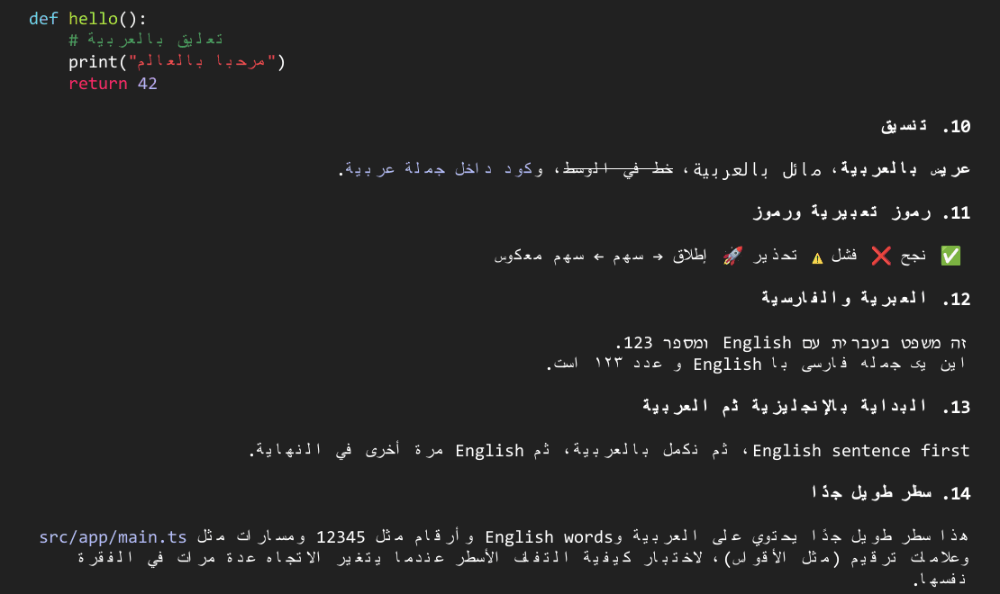
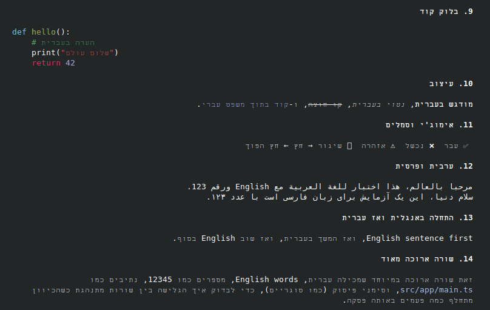
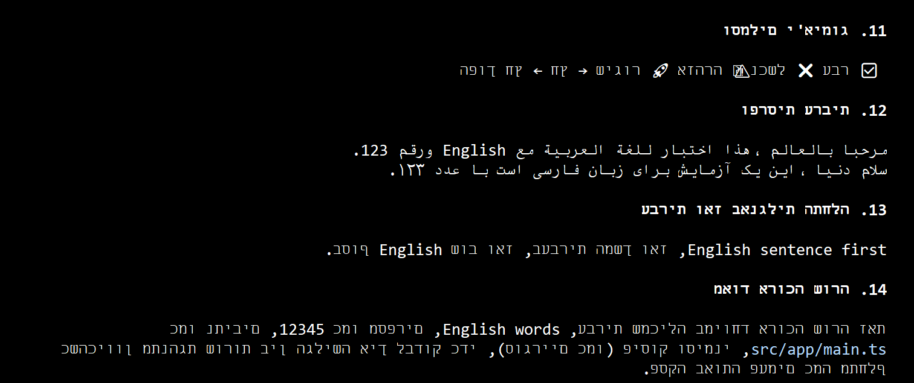
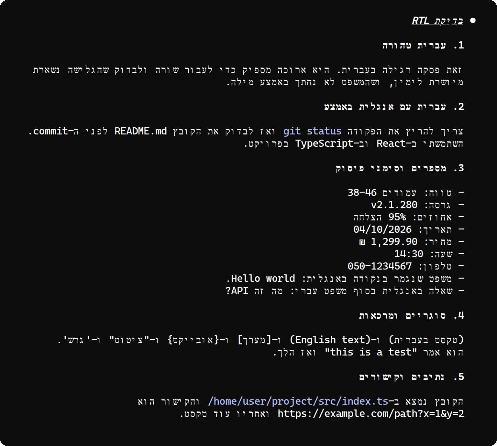

# Terminal screenshots

These screenshots show the same Claude Code reply, with the mod on, in each terminal in the
[support table](../README.md#terminal-support). They were taken on Windows 11 (build 26200) with
Ubuntu in WSL and Claude Code 2.1.289. Mod settings are at their defaults unless a note says
otherwise.

## Windows Terminal 1.24

The screenshots at the top of the [README](../README.md) were taken in Windows Terminal, with its
default font and colors and Claude Code started as usual. In Windows Terminal, Claude Code
reorders right-to-left text itself (it does so when `WT_SESSION` is set, and in the VS Code
terminal). The mod detects this and draws its lines so that they come out in the right order.
Claude Code 2.1.289 was also run in tmux with `WT_SESSION` set and with it unset, and every cell
of the reply matched.

Keep `arabic` at `letters`: Windows Terminal joins the letters itself, and its default font has no
glyphs for the joined shapes that `forms` writes.

## WezTerm 20240203

Tested with the Arabic reply and `arabic` set to `forms`. WezTerm's own bidi option is off by
default; keep it off.

## Konsole 23.08

Tested with **Bi-Directional text rendering** turned off in the profile (here with
`konsole -p BidiRenderingEnabled=false`) and `arabic` set to `forms`. With that option on,
Konsole reorders the text itself. Setting `order` to `logical` then gets the letters right, but
punctuation, emoji and English words inside right-to-left lines still land on the wrong side.

## mintty 3.8 (wsltty)

Tested with mintty's bidi turned off (`-o Bidi=0`) and `arabic` set to `forms`. Lines reach the
right edge, words sit in their places, and Arabic and Persian read correctly, but the letters
inside each Hebrew word are reversed. With mintty's bidi on (its default), the letters are in
order, but the words are reversed and the lines start at the left. Neither setting gives readable
Hebrew yet.

## Browser terminals (xterm.js 6.1)

Drawn by xterm.js 6.1, the terminal inside many browser-based tools, with its DOM renderer. For
Arabic and Persian, set `arabic` to `forms`.

